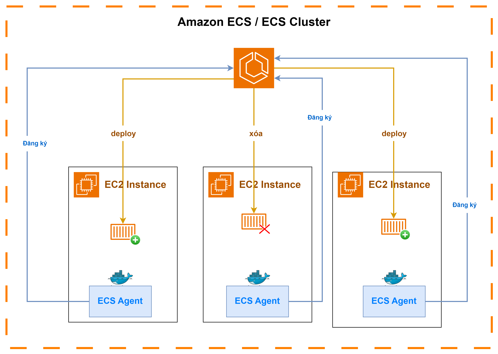
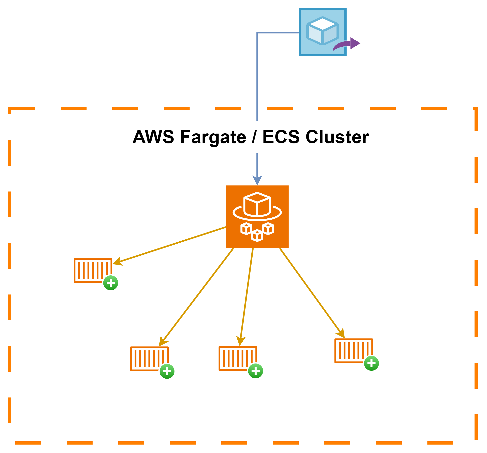
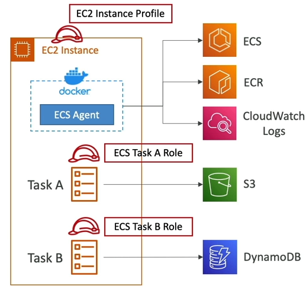
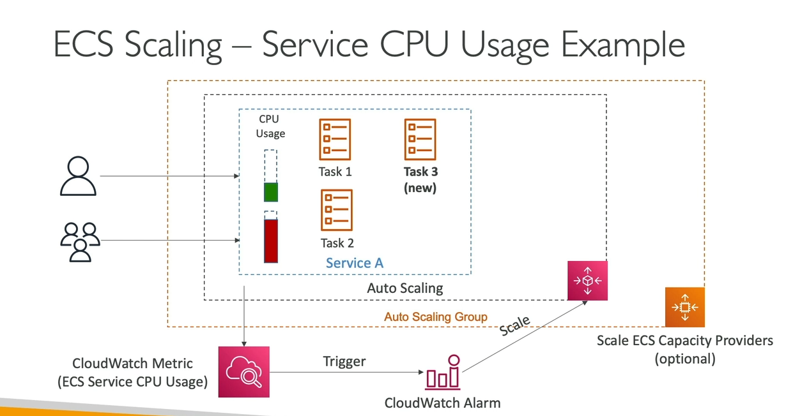
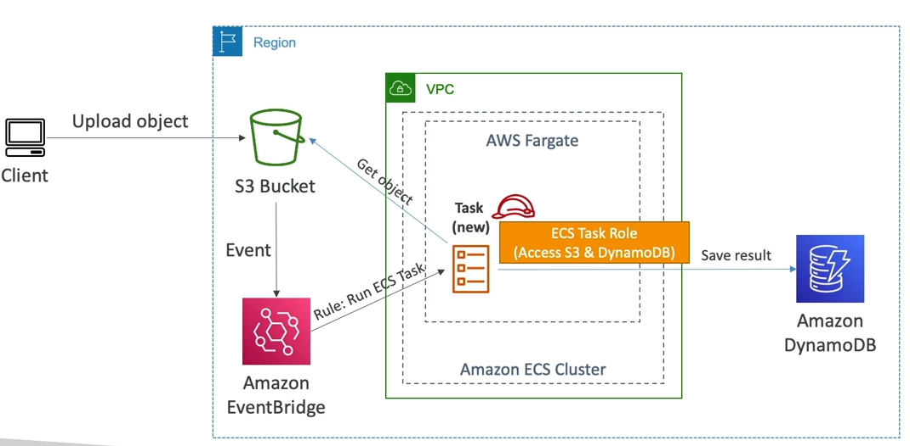
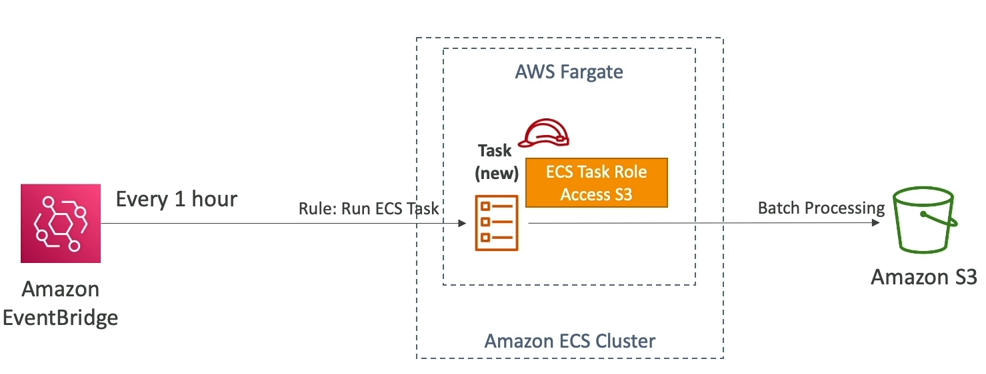
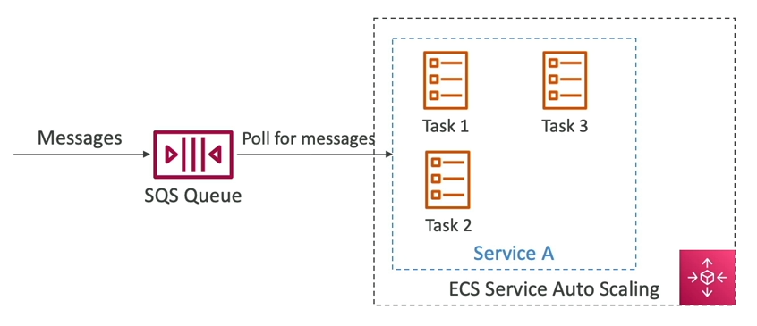

# Amazon ECS
- ECS là viết tắt cho cụm từ **Elastic Container Service**
- Việc khởi động một Docker Container trên AWS nghĩa là khởi động một task ECS trên cụm ECS.

## Khởi động theo kiểu EC2

Chúng ta sẽ cần phải ước lượng và bảo trì hạ tầng (mà cụ thể là các EC2 instance).

- Mỗi EC2 Instance sẽ có một ECS Agent chạy bên trong nó và sẽ đăng ký với ECS.
- AWS lúc này sẽ quản lý việc khởi động / tắt các container bên trong EC2.

## Khởi động theo kiểu Fargate

- Khởi động Docker container trên AWS.
- Chúng ta không cần phải biết truớc hạ tầng (vì sẽ không chạy trên EC2).
- Serverless.
- Chúng ta chỉ cần đơn giản là đưa một image và AWS sẽ tự động chạy container với CPU / RAM mà chúng ta cần.
- Để scale thì chỉ đơn giản là tăng thêm số lượng task.

## IAM Role cho ECS

- IAM Role cho bản thân EC2 Instance (đối với loại khởi động bằng EC2):

  - Sẽ được sử dụng bởi ECS agent bên trong EC2.
  - Có thể gọi API đến các dịch vụ ECS khác.
  - Gửi logs của container đến CloudWatch Logs.
  - Pull Docker Image từ ECR.

- IAM Role cho mỗi Task ECS:
  - Cho phép mỗi taks có một role cụ thể.
  - Cho phép chung ta sử dụng nhiều role khác nhau cho các dịch vụ ECS2 khác nhau.
  - Task Role sẽ được định nghĩa tại task definition.

## Tích hợp Load Balancer

ECS và Fargate có thể tích hợp thoải mái với ALB trong hầu hết các trường hợp.

Ngoài ra còn có thể tích hợp với NLB, nhưng chỉ khuyến khích khi chúng ta cần throughput cao / hiệu suất cao.

## Data Volumes (EFS) trên ECS

- Chúng ta có thể mount EFS file system vào ECS task.
- Hỗ trợ cho cả hai loại khởi động EC2 và Fargate.
- Các task đang chạy ở nhiều AZ khác nhau sẽ chia sẻ dữ liệu bên trong EFS file system.
- Fargate + EFS = Serverless.
- TH Sử dụng: cung cấp một nơi lưu trữ đa vùng bền vững cho các container.
- Lưu ý: Amazon S3 không thể được mount như file system.

## Auto Scaling trong ECS

Là tính năng cho phép tự động tăng hoặc số lượng task dựa theo một tiêu chí nào đó.

ECS Auto Scaling sử dụng một dịch vụ là **AWS Application Auto Scaling**, là dịch vụ cho phép chúng ta thiết lập auto scaling theo:

  - Mức sử dụng CPU trung bình của dịch vụ ECS.
  - Mức sử dụng bộ nhớ trung bình của dịch vụ ECS.
  - Số lượng request gửi đến ALB - thông số đến từ Load Balancer.

Ngoài ra còn có:

- **Target tracking** - scale đến khi đạt được một giá trị cụ thể nào đó trong CloudWatch.
- **Step scaling** - scale dựa vào một CloudWatch Alarm nào đó xảy ra.
- **Scheduled Scaling** - scale dựa theo ngày giờ / thời gian cụ thể (khi chúng ta dự đoán được).

Chú ý là việc scale ECS service ở mức độ các task **không giống** với EC2 auto scaling (nghĩa là scale ở mức độ EC2 instance).

Vì thế, khi chúng ta không cần sử dụng EC2 Instance ở backend thì Fargate Auto Scaling group sẽ dễ dàng thiết lập hơn rất nhiều (vì nó là serverless).

### Auto Scaling cho EC2 instance khi khởi động ở dạng EC2.

Hướng tiếp cận này sẽ tăng / giảm số lượng EC2 sẽ sử dụng bên trong dịch vụ ECS. Chúng ta có thể nghĩ đến:

**Auto Scaling Group - ASG**
- Scale ASG dựa theo mức sử dụng CPU.
- Thêm EC2 instance theo thời gian.

**ECS Cluster Capacity Provider**
- Là một dịch vụ mới.
- Có vai trò sẽ tự động dự đoán và scale hạ tầng để phù hợp với ECS Task.
- Capacity Provider sẽ đi chung với ASG.
- Thêm EC2 instance vào khi thiếu hụt (về CPU, RAM, ...)

# ECS Architect Solutions

Dịch vụ ECS có thể là giải pháp hạ tầng cho một số use case thực tế, chẳng hạn:

**Use case 1 - Thiết lập các ECS Task sẽ được kích hoạt bởi Event Bridge**

Bài toán: Sử dụng một docker container để xử lý và lưu trữ thông tin về object được upload lên S3 vào DynamoDB.

Giả sử:
- Có một ECS Cluster với back-end là AWS Fargate.
- Có một S3 Bucket để lưu trữ object.
- S3 Bucket này sẽ được kết nối với Amazon EventBridge, và vì thế nó sẽ gửi toàn bộ S3 event vào đó.
- EventBridge có một rule sẽ chạy một ECS Task khi một sự kiện nào đó xảy ra.
- Bản thân ECS Task này sẽ có một **Task Role** cho phép nó truy cập vào S3 và DynamoDB.

Cách hoạt động:
1. Client upload một object vào S3.
2. S3 gửi event đến EventBridge.
3. EventBridge nhận event, và tạo một ECS Task mới.
4. Do đã được gắn sẵn role đầy đủ, ECS Task mới tạo sẽ:

    - Truy cập vào S3 để lấy thông tin object.
    - Xử lý object vừa lấy được.
    - Lưu kết quả vào DynamoDB.

**Use case 2 - Thiết lập các ECS Task sẽ được kích hoạt bởi Event Bridge Schedule**

Bài toán: Sử dụng docker container để batch process các object trong S3 theo một lịch nhất định. 

Giả sử:
- Có một ECS Cluster với back-end là Fargate.
- Có một Amazon EventBridge được lên lịch cho một rule nào đó mỗi giờ.
  - Rule này sẽ chạy một task mới trong Fargate.
  - Task này có role sẽ cho phép nó truy cập vào S3.
  - Nhiệm vụ của Task này là Batch process một lượng object nhất định trong S3.

Cách hoạt động:
1. Cứ cách mỗi giờ, EventBridge sẽ chạy một rule.
2. Rule này spawn một Task mới trong Fargate.
3. Task mới sẽ batch process object trong S3.

**Use case 3 - Sử dụng kết hợp với SQS Queue**

Giả sử:
- Có một Service trên ECS với hai ECS Task.
- Service được nằm trong một ECS Auto Scaling.
- Có một SQS Queue để nhận message được gửi đến.

Cách hoạt động:
1. Các message được gửi đến SQS Queue.
2. Service sẽ poll message đó về và xử lý.
3. Nhờ vào ECS AutoScaling, Số lượng message có trong SQS càng nhiều thì chúng ta có thể có thêm nhiều ECS Task được tạo ra để xử lý tương ứng.

