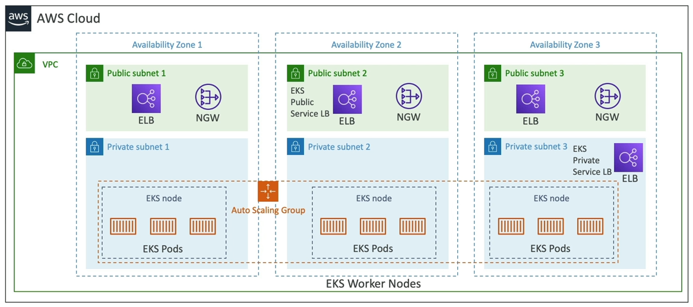

# Amazon EKS
Amazon EKS - Amazon Elastic Kubernetes Service là dịch vụ cho phép chạy và quản lý các cụm Kubernetes trên AWS.

Về cơ bản, Kubernetes là một hệ thống mã nguồn mở để tự động triển khai, mở rộng và quản lý các ứng dụng container (mà thường là Docker).

Nghĩa là, nó tương tự như ECS, có cùng một mục tiêu nhưng khác API sử dụng. Ngoài ra Kubernetes là mã nguồn mở còn ECS thì không.

Giống như ECS, EKS hỗ trợ triển khai theo kiểu EC2 nếu muốn triển khai dưới dạng các worker node hoặc Fargate nếu muốn triển khai dưới dạng các serverless container.

Trường hợp sẽ sử dụng EKS: nếu công ty của bạn đã và đang sử dụng hạ tầng Kubernetes hoặc bên trong một nền tảng đám mây khác và quyết định chuyển sang AWS để quản lý các cụm Kubernetes.

Chú ý: Kubernetes không phụ thuộc vào nền tảng đám mây (có thể sử dụng bất kì nền tảng nào như GCP, Azure, AWS, ...)

## Lược đồ
- Chúng ta có một VPC trải dài trên 3 AZ.
- Mỗi AZ có 2 phần: public subnet và private subnet.
- Mỗi private subnet có một EKS node.
- Mỗi EKS node sẽ chạy các EKS Pods bên trong nó (tương tự ECS Task, nhưng trong ngữ cảnh của K8s thì ta hay dùng định nghĩa pods).
- Các EKS node này sẽ nằm trong và được quản lý bởi một ASG.
- Tương tự như ECS, nếu chúng ta muốn expose EKS Service và Kubernetes Service thì có thể thiết lập một Private Load Balancer để chúng giao tiếp hoặc một Public Load Balancer nếu cần giao tiếp qua mạng.

## Các loại EKS Node

- Node thuộc nhóm được quản lý sẵn:
  - Sẽ tạo và quản lý các node (EC2 instance) cho chúng ta.
  - Các node là một phần của ASG được quản lý bởi EKS.
  - Hỗ trợ On-demand hoặc Spot Instance.

- Node tự quản lý:
  - Là loại mà chúng ta sẽ tự tạo, tự đăng ký nó với EKS Cluster và được quản lý bởi một ASG.
  - Có thể sử dụng cái AMI được xây dựng sẵn từ trước.
  - Hỗ trợ On-demand và Spot Instance.

- AWS Fargate:
  - Không cần bảo trì cũng như không cần quản lý node.

## Data Volume trên EKS
- Cần phải chỉ định **Storage Class** manifest trên EKS cluster.
- Tận dụng một **Container Storage Interface (CSI)** phù hợp.
- Hỗ trợ:
    - Amazon EBS.
    - Amazon EFS (Fargate chỉ dùng đc loại này).
    - Amazon FSx cho Lustre.
    - Amazon FSx cho NetApp ONTAP

