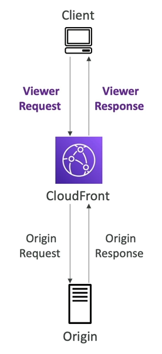

# Lambda@Edge & Cloudfront Function
- Nhiều hệ thống hiện đại sẽ có nhu cầu thực hiện một số tác vụ tính toán logic tại các edge trước khi gửi đến chương trình cuối. Đây gọi là các **Edge Function**.
- Edge Function:
    - Là đoạn mã mà chúng ta sẽ viết rồi đính kèm nó vào CloudFront distribution.
    - Mục tiêu viết các hàm logic mà được thực thi ở gần vị trí của người dùng nhất có thể để giảm tối đa độ trễ.
- Cloudfront có hai loại function: **Cloudfront function** và **Lambda@Edge**
- Với việc sử dụng **Edge function**, chúng ta không cần phải quản lý server để chạy nó, cũng như có thể triển khai trên toàn cầu.
- Use case: tùy chỉnh lại nội dung CDN.

## Cloudfront Function
Đầu tiên, chúng ta hãy xem xét luồng request thông thường của Cloudfront diễn ra như thế nào.
- Người dùng gửi request đến Cloudfront (còn gọi là Viewer request).
- Cloudfront tạo một Origin request đến server gốc.
- Server sẽ phản hồi Origin request và trả về Origin Resposne.
- Cloudfront nhận  Origin Response rồi trả về kết quả cho người dùng (còn gọi là viewer resposne).

Trong khi đó, các Cloudfront function:
- Là các lightweight functionn được viết bằng JavaScript.
- Dùng khi cần điều chỉnh CDN để phục vụ các tính năng cần scale cao, nhạy cảm với độ trễ.
- Khởi động chỉ trong vài mili giây và có thể xử lý hàng triệu request mỗi giây.
- Được sử dụng chủ yếu để thay đổi nội dung của Viewer Request và Viewer Response.
- Là tính năng gốc của Cloudfront (nghĩa là việc quản lý code hoàn toàn bên trong Cloufront).

## Lambda@Edge
- Lambda Function được viết bằng NodeJS hoặc Python.
- Có thể hỗ trợ đến hàng ngàn request mỗi giây.
- Dùng để thay đổi Cloudfront request/response:
    - Thay đổi cả Viewer Request và Origin Request.
    - Thay đổi cả Viewer Response và Origin Response.
- Chúng ta viết function tại một AWS region, rồi sau đó Cloudfront sẽ replica function này đến các Cloudfront distribution.

## Trường hợp sử dụng

### Cloudfront Function
- Chuẩn hóa cache key
    - Thực hiện chuyển đổi các thuộc tính của request (header, cookies, query string, URL) để tạo ra được các cache key tối ưu.
- Thay đổi header
    - Thêm/chỉnh sửa/xóa một số HTTP Header trong request hoặc response.
- Viết lại URL hoặc redirect
- Xác thực và phân quyền request.
    - Tạo và xác thực các token (như JWT) để cho phép hoặc từ chối request.

### Lambda@Edge
- Các tác vụ có thời gian thực thi lâu hơn (trong vài ms).
- Các tác vụ có thể cần thay đổi CPU và memory.
- Mã phụ thuộc vào SDK hoặc thư viện bên thứ 3.
- Cần truy cập mạng để sử dụng thêm một số dịch vụ bên ngoài.
- Cần truy cập vào file system hoặc body của HTTP request.