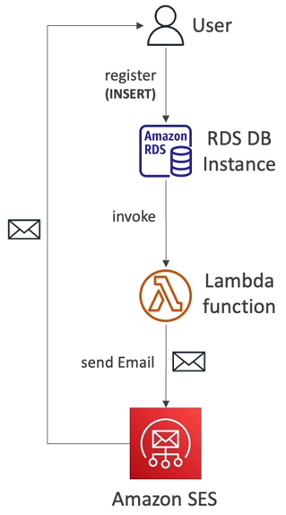
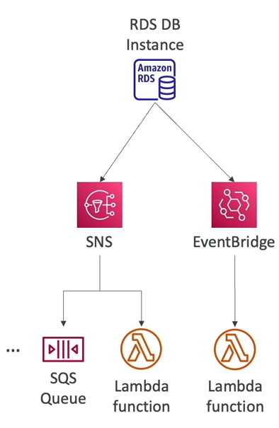

# Invoking Lambda from RDS & Aurora

- Chúng ta thực ra có thể invoke lambda function từ RDS instance bằng một số cách kết hợp dịch vụ.
- Điều này cho phép chúng ta xử lý dữ liệu về sự kiện đã xảy ra bên trong database.
- Hỗ trợ RDS PostgreSQL và Aurora MySQL.

Ý tưởng về cơ bản là người dùng insert một một dữ liệu mới vào DB (có thể là qua thao tác đăng ký tài khoản), RDS sẽ được thiết lập để gọi một trực tiếp đến Lambda Function, Lambda Function sau đó có thể gửi một tin nhắn chào mừng đến với người dùng qua email.

Về cơ bản, để thiết lập hệ thống trên sẽ yêu cầu chúng ta kết nối trực tiếp vào database rồi thiết lập chứ không phải từ một màn hình dashboard cụ thể, và khi bạn làm thế thì:

- **Bắt buộc phải mở một outbound traffic đến Lambda function bên trong DB instance** (Có thể là Public, NAT, Gateway, VPC endpoints).
- DB instance tất nhiên phải có quyền để gọi đến Lambda Function (Dùng Lambda Resource-based Policy và IAM Policy).

Chú ý, hệ thống này **hoàn toàn khác biệt so với việc sử dụng RDS Event Notification**.

# RDS Event Notification

- Các thông báo sẽ cho thông tin liên quan đến bản thân DB instance (created, stopped, start, ...)
- Bạn không hề có thông tin gì về dữ liệu của DB (đừng rơi vào cái bẫy này trong bài kiểm tra).
- Bạn chỉ có thể subscribe và lấy thông tin về các danh mục như: **DB Snapshot**, **DB Parameter Group**, **DB Security Group**, **RDS Proxy**, **Custom Engine Version**.
- Độ trễ gần với thời gian thực (khoảng 5 phút).
- Thông báo có thể gửi tới SNS hoặc EventBridge.

