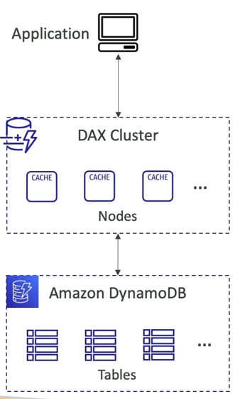
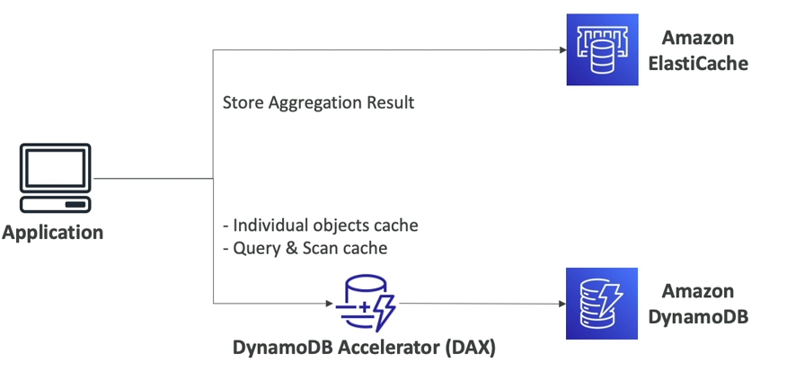
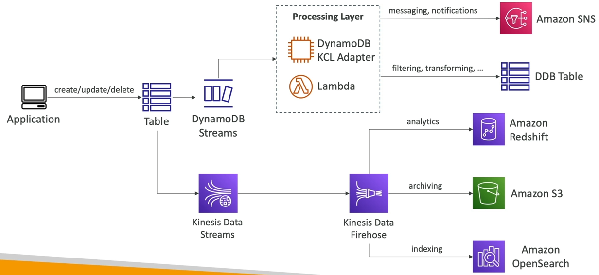

# DynamoDB Accelerator (DAX)

- Là một memory cache dành cho DynamoDB được quản lý toàn diện, sẵn sàng cao với liền mạch.
- Giúp tránh tắc nghẽn Read bằng cách cache.
- Độ trễ chỉ trong khoảng vài micro giây cho dữ liệu cache.
- Không yêu cầu chúng ta thay đổi bất cứ thứ gì về code của ứng dụng (vì nó tuong thích với DynamoDB API).
- Bộ nhớ cache có TTL mặc định là 5 phút.

# DynamoDB Accelerator (DAX) vs ElastiCache

- DAX đứng ngay trước DB nên cache với DAX sẽ phù hợp khi truy vấn các đối tượng riêng lẻ từ từng bảng trong DB.

- Trong khi đó ElastiCache thì phù hợp để cache các dữ liệu được tính toán hay tập hợp từ nhiều nguồn khác nhau.

- Nhưng trong đa số trường hợp khi cần cache ở tầng DB thì sẽ sử dụng DAX nhiều hơn.

# DynamoDB - Stream Processing

- Là một luồng các thao tác được thực thi trên các item (create/update/delete) trong bảng.
- Trường hợp sử dụng:
    - Phản ứng với các thay đổi đã xảy ra (như gửi tin nhắn chào mừng đến người dùng).
    - Phân tích tình trạng sử dụng theo thời gian thực.
    - Invoke Lambda Function mỗi khi có thay đổi xảy ra trong DynamoDB table.
- Có hai loại luồng thường dùng:
    -  DynamoDB Stream:
        - Giữ dữ liệu trong 24 giờ.
        - Số lượng consumer hạn chế.
        - Việc xử lý dữ liệu sử dụng AWS Lambda Trigger hoặc DynamoDB Stream Kinesis adapter.
    - Kinesis Data Stream:
        - Giữ dữ liệu trong 1 năm.
        - Số lượng consumer nhiều.
        - Có nhiều cách để xử lý dữ liệu hơn: AWS Lambda, Kinesis Data Analytics, Kinesis Data Firehose, AWS Glue Streaming ETL, ...

# DynamoDB Global Table

Global Table là các bảng có replica được trải dài trên nhiều vùng.

Ý tưởng là:
- Cho phép các bảng trong DynamoDB có thể được truy cập với độ trễ thấp trên nhiều vùng khác nhau.
- Active-Active Replication, nghĩa là chương trình có thể READ hoặc WRITE trên bất kì bảng nào.
- Cần phải bật DynamoDB Stream trước vì nó là hạ tầng bên dưới sẽ được dùng để chạy tính năng này.

# DynamoDB TTL
- Cho phép tự động xóa một item sau một khoảng thời gian nhất định.
- Trường hợp sử dụng: cho phép giảm số lượng dữ liệu cần lưu trữ nếu như dữ liệu đó chỉ cần khả dụng trong một khoảng thời gian nhất định như web session.

# DynamoDB - Backups đề hồi phục sau thảm họa
- Liên tục backups bằng cách sử dụng poin-in-time recovery (PITR).
    - Có thể được bật để áp dụng cho 35 ngày gần nhất như là một tùy chọn thêm.
    - Quá trình khôi phục sẽ tạo ra một bảng mới.
- On-demands backup
    - Backup toàn diện cho các bản lưu trữ dài hạn cho tới khi nó chủ động bị xóa.
    - Không ảnh hưởng đến hiệu suất hay độ trễ.
    - Có thể cấu hình để được quản lý qua AWS Backup.
    - Quá trình khôi phục sẽ tạo ra một bảng mới.

# DynamoDB - Kết hợp với Amazon S3
- Chúng ta có thể export các bảng trong DynamoDB vào S3 (phải bật PITR).    
    - Có thể áp dụng cho 35 ngày gần nhất tại bất kì thời điểm nào.
    - Không ảnh hưởng đến khả năng đọc của bảng.
    - Export theo DynamoDB JSON format hoặc ION format.
- Có thể import bảng từ S3.
    - Hỗ trợ import dưới dạng CSV, DynamoDB JSON hoặc ION format.
    - Tạo ra bảng mới.
    - Các lỗi xảy ra trong quá trình import sẽ được log tại CloudWatch logs.