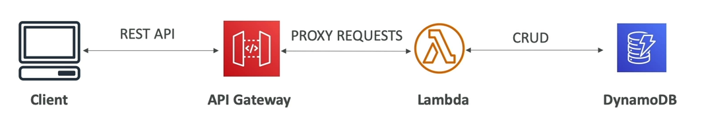
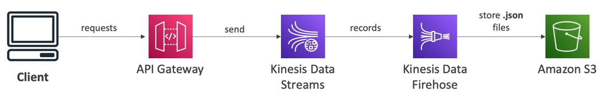

# Example: Building a Serverless API

Cho đến hiện tại chúng ta đã biết cách sử dụng Lambda Function và DynamoDB trong một hệ thống Serverless. 

Chúng ta biết rằng Lambda Function có thể thực hiện các tác vụ CRUD trên DynamoDB.

Giả sử, lúc này bạn muốn client sẽ gọi đến Lambda function để sử dụng, để hiện thực điều này chúng ta cũng có nhiều giải pháp khác nhau:
- **Client invoke trực tiếp lambda function**: với cách tiếp cận này, client cần có một IAM permission.
- **Client invoke lambda function thông qua một ALB**.
- **Sử dụng API Gateway để làm Rest API**:
    - Đây là giải pháp Serverless được cung cấp bởi AWS.
    - Tạo một Rest API cho Lambda Function, endpoint này sẽ được public và có thể truy cập được đối với client.
    - API Gateway sau đó sẽ proxy request của client đến Lambda Function.
    - Giải pháp này cung cấp nhiều tính năng hơn là chỉ một HTTP endpoint.

# AWS API Gateway
- Lambda Function + API Gateway: cách kết hợp này sẽ cho phép chúng ta không cần quan tâm đến hạ tầng bên dưới, là một giải pháp thuần Serverless.
- Hỗ trợ giao thức WebSocket.
- Hỗ trợ versioning API.
- Xây dựng nhiều môi trường khác nhau (dev, test, prod, ...)
- Hỗ trợ bảo mật (Authentication và Authorization).
- Tạo API Key, xử lý vấn đề nghẽn request truy cập.
- Hỗ trợ tích hợp Swagger / Open API để nhanh chóng định nghĩa API.
- Chuyển đổi và validate request / response.
- Cache API response.

## API Gateway - Integration High Level

- Lambda Function:
    - Invoke Lambda function.
    - Dễ dàng expose một REST API có back-end là một Lambda.
- HTTP:
    - Expose bất kì HTTP endpoint nào ở back-end.
- AWS Service:
    - Expose bất kì AWS API nào thông qua API Gateway
    - Chẳng hạn: bắt đầu một AWS Step Function, post một message đến SQS.

**AWS Service Integration - Kinesis Data Stream Example**

Chúng ta muốn người dùng gửi dữ liệu vào Kinesis Data Stream, nhưng quá trình này nên được bảo mật mà không cần phải đưa cho họ giữ AWS credentials. Cách làm là:
- Ở giữa Client và Kinesis Data Stream, chúng ta chèn API Gateway vào đó.
- Client sẽ gửi HTTP Request đến API Gateway.
- API Gateway sẽ được thiết lập để gửi message đến Kinesis Data Stream.
- Kinesis Data Stream sau đó có thể gửi bản mới đến Kinesis Data Firehose.

## API Gateway - Endpoint Types

- **Edge-Optimized (mặc định)**:
    - Dành cho client trên toàn cầu.
    - Request sẽ được định hướng để đi đến các Cloufront Edge trên toàn thế giới (cải thiện độ trễ).
    - API Gateway vẫn sẽ chỉ ở một vùng nhất định.
- **Regional**:
    - Cho các người dùng nội bộ trong khu vực.
    - Vẫn có thể kết hợp thủ công với Cloudfront (cho phép chúng ta tùy chỉnh linh động hơn về chiến thuật cache và phân phối).
- **Private**:
    - Chỉ có thể được truy cập từ VPC nội bộ của chúng ta bằng cách sử dụng một interface VPC endpoint (ENI).
    - Sử dụng resource policy để khai báo truy cập.

## API Gateway - Security

- Xác thực người dùng qua:
    - IAM Role (Hữu ích cho các ứng dụng nội bộ).
    - Cognito (Xác minh cho các người dùng bên ngoài).
    - Một bộ xác minh tự tùy chỉnh do chính chúng ta code nên.
- Bảo mật HTTPS cho domain bằng cách kết hợp với dịch vụ AWS Certificate Manager (ACM):
    - Nếu sử dụng Edge-Optimized endpoint, thì chứng chỉ cần lấy ở **us-east-1**.
    - Nếu sử dụng Regional endpoint, chứng chỉ cần lấy tại region mà API Gateway được tạo ra.
    - Cần phải thiết lập một CNAME hoặc Alias Record trong Route 53.
    