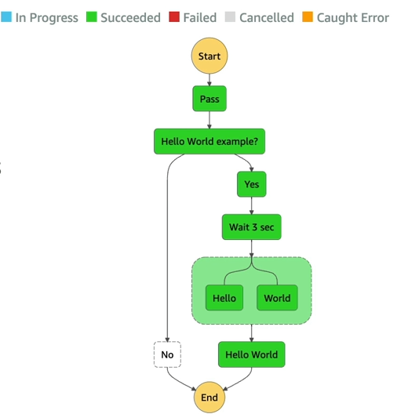

# AWS Step Functions

- Là dịch vụ cho phép chúng ta xây dựng một workflow để điều hành (orchestrate) các Lambda Function.
- Tính năng: tuần tự, song song, có điều kiện, thời gian chờ, xử lý lỗi xảy ra, ...
- Có thể kết hợp với các dịch vụ khác như EC2, ECS, các máy chủ tại chỗ, API Gateway, hàng đợi SQS, ...
- Có thể implement thêm tính năng cần sự chấp nhận của con người trước khi thực hiện workflow.
- Use case: hoàn thành đơn hàng, xử lý dữ liệu, các ứng dụng web, ...

