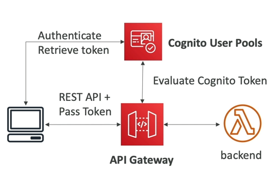
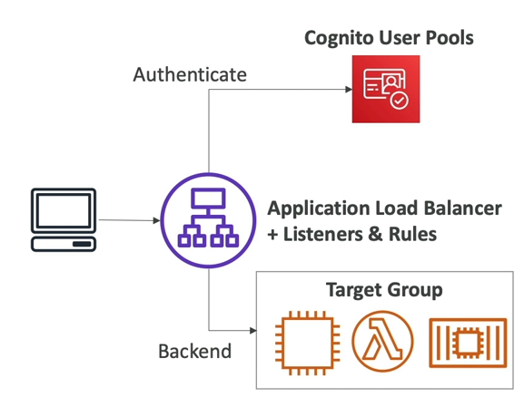
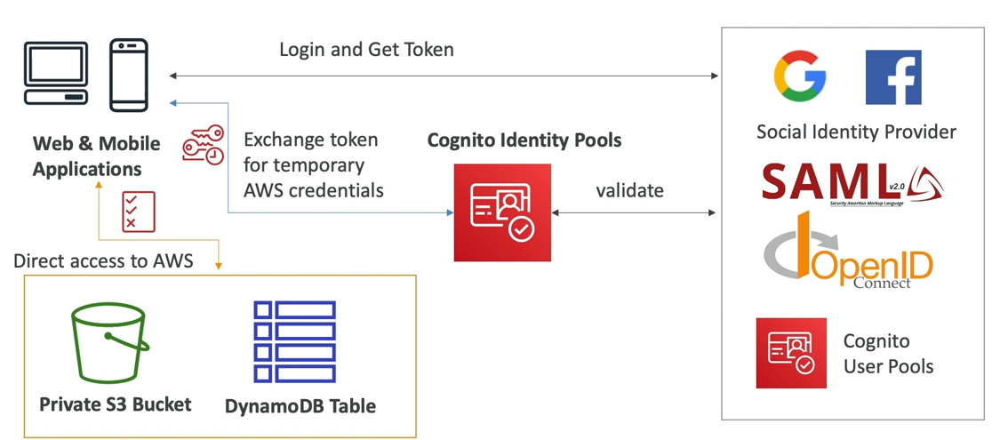

# Amazon Cognito

- Là dịch vụ sẽ cung cấp cho người dùng một danh tính để có thể tương tác với ứng dụng web hoặc mobile của chúng ta.
- Có hai loại service con bên trong Cognito.
- **Cognito User Pools (CUP)**
  - Tính năng đăng nhập cho app user.
  - Có thể tích hợp tốt với API Gateway & ALB.
- **Cognito Identity Pools (CIP)**
  - Cung cấp một danh tính AWS cho người dùng để họ có thể sử dụng tài nguyên trên AWS một cách trực tiếp.
  - Tích hợp với Cognito User Pools như là một bên cung cấp danh tính (identity provider).
- Phân biệt Cognito vs IAM:
  - Cognito được sử dụng để cung cấp danh tính cho các người dùng bên ngoài AWS.
  - Có thể lên tới hàng trăm, hàng ngàn người dùng trên ứng dụng web hoặc ứng dụng điện thoại.

## Cognito User Pools

### User Features

- Tạo một serverless database cho người dùng, phục vụ cho ứng dụng web & mobile của chúng ta.
- Đăng nhập đơn giản: username (hoặc email) / password.
- Reset password.
- Xác minh Email & SĐT.
- Xác minh danh tính trên nhiều thiết bị (MFA).
- Liên kết danh tính với tài khoản Facebook, Google, ...

### Integrations

- CUP có thể kết hợp với API Gateway.
  - Người dùng sẽ kết nối đến CUP để nhận token.
  - Sau đó, người dùng gửi token đến API Gateway.
  - Nếu token hợp lệ, API Gateway sẽ gọi đến backend và backend đã biết được user cần phục vụ là ai.
  - 
- Một cách kết hợp khác là CUP + Application Load Balancer.
  - Người dùng sẽ kết nối tới ứng dụng qua ALB.
  - ALB sẽ thực hiện xác minh danh tính người dùng bằng CUP.
  - Nếu hợp lệ, ALB sẽ thêm vào một số thông tin người dùng vào request rồi chuyển hướng request xuống backend.
  - 

## Cognito Identity Pools (Federated Identites)

- Lấy một danh tính AWS tạm thời cho người dùng.
- Người dùng gốc có thể là người dùng của CUP hoặc qua một bên thứ ba nào đó.
- Với danh tính AWS tạm thời, người dùng có thể truy cập trực tiếp tài nguyên trên AWS hoặc thông qua API Gateway.
- IAM Policy được áp dụng cho danh tính AWS tạm thời trên sẽ được khai báo trong Cognito.
- Chúng cũng có thể được tùy chỉnh lại dựa theo user_id để có thể cấp quyền linh hoạt hơn.
- Có thể thiết lập một IAM Role mặc định dành dành cho người dùng đã được xác thực hoặc khách vãng lai.

